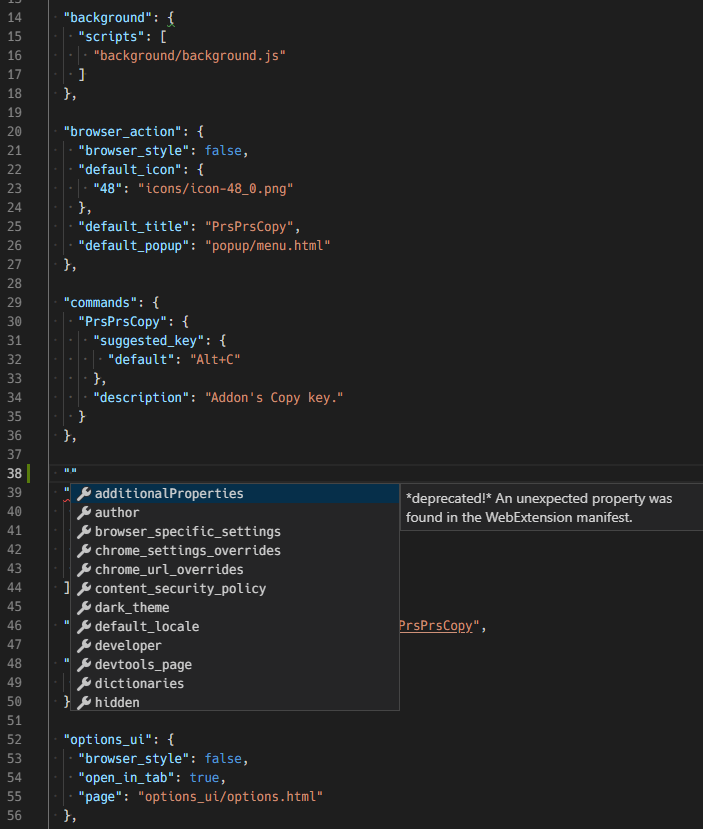
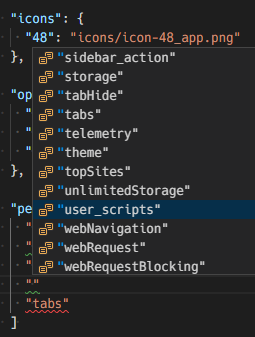

* JSON Schema for Firefox WebExtensions.
* for ones who want to catch up new versions. npm package is based on nightly (mozilla-central).
* I do not think that this package is useful for Google Chrome's manifest.json, 
  so this package is prefixed as 'firefox'.
* status: raughly O.K.


## how to use

As for VS Code's workspace config, such as `foo.code-workspace`

```
  {
    "settings": {
      "json.schemas": [
        {
          "fileMatch": ["*/path/to/manifest.json"],
          "url": "./path/to/ffext.min.json",
        }
      ]
    }
  }
```

Then you will get:





## how to make JSON Schema file

```console
$ npm run build -- --mozilla-repo /path/to/mozilla
```

# Known Issue

## `//` comment

One-line comment is allowed (only Firefox?), but I can not specify it in the JSON Scheme.

## `default_locale`

For `default_locale`, to be mandatory or prohibited is conditional.
Its condition cannot be described in this JSON Schema, because it involves the existence of `_locales` directory.

## Warning "Matches multiple schemas when only one must validate"

VS Code's validator does not discriminate objects inside `oneOf`
and result in that warning on `background` or so.

```sample.json
  {
    "two different subschema cannot be discriminated."
    "background": {
      "oneOf": [
        {
          "type": "object",
          "properties": {
            "page": {
              "type": "number"
            }
          }
        },
        {
          "type": "object",
          "properties": {
            "scripts": {
              "type": "array",
              "items": {
                "$ref": "#/definitions/ExtensionURL"
              }
            },
            "persistent": {
              "$ref": "#/definitions/PersistentBackgroundProperty"
            }
          }
        }
      ]
    }
  }
```

c.f. [Combining schemas — Understanding JSON Schema 7.0 documentation](https://json-schema.org/understanding-json-schema/reference/combining.html)


## `format` may result in error or warning


JSON Schema Document says "JSON Schema implementations are not required to implement this part of the specification, and many of them do not".

As for VS Code, validator seems to do nothing for `format`.

So, this schema currently does nothing for it, and non-standard `format`
such as `strictRelativeUrl` remains in.

c.f. [string — Understanding JSON Schema 7.0 documentation](https://json-schema.org/understanding-json-schema/reference/string.html)


## Note for implementation

### `$id` does not work

JSON Schema Document says "This functionality isn’t currently supported by the Python jsonschema library".

I do not know about VS Code's JSON Schema Validator, but anyway it does not handle `$id`.

c.f. [Structuring a complex schema — Understanding JSON Schema 7.0 documentation](https://json-schema.org/understanding-json-schema/structuring.html)


### 'match mode (?i)' of RegExp

For the case of `string` type, it can have `pattern` keyword.
JSON Schema does not handle it, and that results in RegExp error.


# Reference

some useful staff.

* [manifest.json - Mozilla | MDN](https://developer.mozilla.org/en-US/docs/Mozilla/Add-ons/WebExtensions/manifest.json)

* [pkcs11 - Mozilla | MDN](https://developer.mozilla.org/en-US/docs/Mozilla/Add-ons/WebExtensions/API/pkcs11)

* [API Implementation Basics — Mozilla Source Tree Docs 68.0a1 documentation](https://firefox-source-docs.mozilla.org/toolkit/components/extensions/webextensions/basics.html#webextensions-experiments)

  For `experiments`.

* [API Schemas — Mozilla Source Tree Docs 68.0a1 documentation](https://firefox-source-docs.mozilla.org/toolkit/components/extensions/webextensions/schema.html)

  This says "Refer to the documentation and examples at the JSON Schema site for details on how these items are defined in a schema".
  But some items in API schema (e.g. `choices`) does not match with specs of all versions like 0.4 or 0.7 currently (2019 March) on that site.

* mozilla-central (or mozilla-beta or so)'s `toolkit/components/extensions/Schemas.jsm`

  This module handles `preprocess`, `optional` or so.


# License
MPL-2.0.

npm package includes json files. These contains contents which come from 
json schema files of mozilla-central repository. 
Some ones are under 3-Clause BSD License, others are under MPL-2.0 License. 
Both are in `License` directory.

# Release Notes

* 2019-04-02 0.1.0
* 2019-04-28 0.2.0 `chrome_settings_overrides`: `search_url_get_params`, `suggest_url_get_params`, `search_form`
* 2019-05-09 0.3.0 New `captivePortal` Api. Deleted `icons` of `ThemeType`.
  [1545159](https://bugzilla.mozilla.org/show_bug.cgi?id=1545159)
* 2019-05-19 0.4.0 fix: 10 permissions are not included.

  * `downloads.open`, `management`, `nativeMessaging`, `theme`, `webRequestBlocking`, `devtools`, `menus.overrideContext`, `activeTab`, `tabs`, `tabHide`

* 2019-05-19 0.4.1 fix: again
* 2019-06-01 0.5.0 New: `urlbar` API
  [1547285](https://bugzilla.mozilla.org/show_bug.cgi?id=1547285)
* 2019-06-15 0.6.0 new `edge` property of `browser_specific_settings`
  [1542351](https://bugzilla.mozilla.org/show_bug.cgi?id=1542351)
* 2019-06-28 0.7.0 New: normandyAddonStudy.json
  [1522214](https://bugzilla.mozilla.org/show_bug.cgi?id=1522214)
* 2019-07-05 No Release
  * `topSites` API moved from `toolkit/` to `browser`
* 2019-07-24 0.8.0 New: `networkStatus` permission
  [1550605](https://bugzilla.mozilla.org/show_bug.cgi?id=1550605)
* 2019-08-19 0.9.0 New: `activityLog` permission
  [1542403](https://bugzilla.mozilla.org/show_bug.cgi?id=1542403)
* 2019-09-12 0.10.0 New: `memory` permission
  [1296898](https://bugzilla.mozilla.org/show_bug.cgi?id=1296898)
* 2019-10-09 0.11.0 Removal: `memory` permission
* 2019-11-01 (NO RELEASE) New: `OnClickData`
  [1405031](https://bugzilla.mozilla.org/show_bug.cgi?id=1405031)
* 2019-11-04 0.12.0 Add: `content_security_policy` may be `{ "extension_pages":xxxx, "content_scripts":xxxx }`
  [1581609](https://bugzilla.mozilla.org/show_bug.cgi?id=1581609)
* 2019-11-08 0.13.0 New property: `l10n_resources`
  [1457865](https://bugzilla.mozilla.org/show_bug.cgi?id=1457865)
* 2019-11-16 0.14.0 
  Change: `chrome_settings_overrides`: `search_provider`: format of `favicon_url` changed from `url` to `relativeUrl`
  [1571110](https://bugzilla.mozilla.org/show_bug.cgi?id=1571110)


[//]: # (vim:expandtab ff=unix fenc=utf-8 sw=2)
